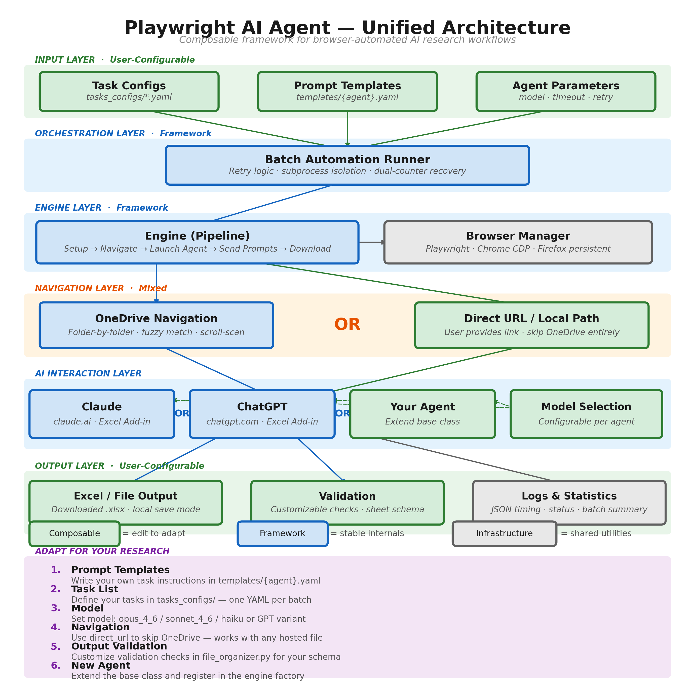

# Web Agent Automation

Automated batch execution of AI agents that work *inside the web chat UIs* of Claude.ai and ChatGPT. The system connects to a real Chrome browser via the Chrome DevTools Protocol, navigates to the chat, uploads task files, sends one or more prompts, and downloads the Excel workbooks the model produces.

> **Looking at the MBABenchV2 repo as a whole?** See [`../AGENTS.md`](../AGENTS.md) for an orientation across all agent suites in this repo.

---

## How this compares to `excel-agents-master`

The sibling repo, [`excel-agents-master/`](../excel-agents-master/), runs AI agents *inside Excel Online add-ins* via OneDrive. Same kind of benchmark output, very different runtime.

|  | This repo (`gui-agents-master`) | Sibling (`excel-agents-master`) |
|---|---|---|
| **Where the AI runs** | Web chat UI (claude.ai, chatgpt.com) | Excel Online add-in panel |
| **Required account** | Claude.ai login or ChatGPT Plus/Pro subscription | Microsoft 365 + OneDrive |
| **Browsers** | Regular Chrome | Chrome Canary + Firefox (TabAI) |
| **Cloud orchestration** | Full EC2 dispatcher in `infra/` for multi-box scaling | None — runs only on your local machine |

→ See [`../AGENTS.md`](../AGENTS.md) for the full feature matrix and the "which suite should I pick?" guide.

---

## One runner, two ways to feed it

`python -m infra.run` is the entry point for every run, local or cloud. What changes between them is the **run config** you hand it — specifically, where tasks come from and where results go.

| `--run-config` names… | Audience | Tasks come from | Results go to |
|---|---|---|---|
| a **local** profile (`source.kind: yaml`, `sink.kind: local`) | **Default — everyone** | A YAML file you write | Local disk under `outputs/` |
| a **cloud** profile (`source.kind: postgres_s3`) | **MBABenchV2 internal team** | Internal Postgres + S3 | S3 + a `task_attempts` row |

Multi-box scaling adds `infra/dispatcher/`, which ssh's into EC2 boxes and invokes the same `infra.run` on each. If you're outside the MBABenchV2 team and want that, the `infra/` code is in the repo for transparency, but it depends on our internal AWS account, Postgres database, and `mbabench` S3 bucket — see the [BYO infrastructure](#byo-infrastructure-external-users) note below. Not turnkey.

---

## Prerequisites

- **Python 3.12+**
- **[uv](https://docs.astral.sh/uv/)** package manager
- **Regular Google Chrome** (Chrome Canary v148+ has a CDP compatibility issue with Playwright — stick with the stable channel)
- **Playwright Chromium browser** binaries (installed below via `playwright install chromium`)
- **Web GUI login** to your provider — this system uses your existing Claude.ai or ChatGPT browser session, **not** API keys. There's nothing to configure with `ANTHROPIC_API_KEY` or `OPENAI_API_KEY`.
- For ChatGPT runs: a paid **ChatGPT Plus or Pro subscription**.

---

## Install

`gui-agents-master` is a member of the MBABenchV2 uv workspace, so dependencies install from the repo root:

```bash
git clone <repo-url>
cd MBABenchV2
uv sync
uv run python -m playwright install chromium
# On Linux only: uv run python -m playwright install-deps chromium
```

Every command below runs from `gui-agents-master/`. Prefix them with `uv run` (or activate the workspace environment) so the interpreter is the one `uv sync` provisioned.

---

## Quickstart — local (default)

You launch a Chrome browser, log into your provider once, and the runner sends tasks through that browser one at a time.

### 1. Launch Chrome with CDP

The automation connects to a real Chrome browser via the Chrome DevTools Protocol. Launch Chrome with remote debugging enabled, on port 9222 with a dedicated profile directory.

Run these **from the repo root** — the profile lives inside the repo, under the gitignored `browser_profiles/`. The commands below use the Claude lane's profile; for ChatGPT runs swap `chrome-claude` for `chrome-chatgpt`, so each provider keeps its own login. Use regular Chrome, not Canary (see [Troubleshooting](#troubleshooting)).

**macOS:**
```bash
"/Applications/Google Chrome.app/Contents/MacOS/Google Chrome" \
  --remote-debugging-port=9222 \
  --user-data-dir="$PWD/browser_profiles/chrome-claude" \
  --no-first-run --no-default-browser-check \
  --disable-background-timer-throttling \
  --disable-backgrounding-occluded-windows \
  --disable-renderer-backgrounding \
  '--remote-allow-origins=*'
```

**Linux:**
```bash
google-chrome \
  --remote-debugging-port=9222 \
  --user-data-dir="$PWD/browser_profiles/chrome-claude" \
  --no-first-run --no-default-browser-check \
  --disable-background-timer-throttling \
  --disable-backgrounding-occluded-windows \
  --disable-renderer-backgrounding \
  --remote-allow-origins=*
```

**Windows (PowerShell):**
```powershell
& "C:\Program Files\Google\Chrome\Application\chrome.exe" `
  --remote-debugging-port=9222 `
  --user-data-dir="$PWD\browser_profiles\chrome-claude" `
  --no-first-run --no-default-browser-check `
  --disable-background-timer-throttling `
  --disable-backgrounding-occluded-windows `
  --disable-renderer-backgrounding `
  --remote-allow-origins=*
```

The `--user-data-dir` flag creates an isolated Chrome profile. Your login session persists across runs as long as you launch Chrome with the same directory — typically a few weeks until cookies expire. Each parallel browser instance needs its own profile dir (and its own port).

This must agree with `<provider>_web.browser.profile_dir` in the run config, which defaults to `browser_profiles/chrome-claude` / `browser_profiles/chrome-chatgpt`. A relative value there is resolved against the repo root, so it names the same profile no matter where you invoke the runner from.

### 2. Log into the provider

In the Chrome window that just opened:

- **For Claude runs**: navigate to https://claude.ai and log in.
- **For ChatGPT runs**: navigate to https://chatgpt.com and log in (Plus or Pro account).

Leave the browser open. The runner connects to it.

### 3. Configure the project ID (per provider)

Both providers identify a "project" or "workspace" you want each task to start in. Set it in your run config under `<provider>_web.project_id` — the automation uses it to keep all task conversations together and (for ChatGPT) to inherit project-level settings like the default model. Leave it `null` to start each chat outside any project.

**For Claude.ai:** go to https://claude.ai/projects, open (or create) a project, and copy `{project_id}` out of the `https://claude.ai/project/{project_id}` URL.

**For ChatGPT:** open **Projects** in the left sidebar, open (or create) one, and copy the hex `{project_id}` from `https://chatgpt.com/g/g-p-{project_id}-{slug}/project` (the part after `g-p-`). Newer projects have **no `-{slug}` suffix**; that's fine — `chatgpt_web.project_slug` is optional.

### 4. Write a run config

A run config is a YAML file under `infra/configs/run_configs/`. If its top level contains task fields (`task_name`, `upload_files`, `tasks`, …) the runner treats the file itself as the task list; everything else in it is overlaid on the project-wide config for that run. Copy [`infra/configs/run_configs/local_run_examples/sample_task.yaml`](infra/configs/run_configs/local_run_examples/sample_task.yaml) and edit:

```yaml
task_name: "My_Analysis"
task_source: "my_tasks"
upload_files:
  - "data/My_Analysis/problem_statement.pdf"
  - "data/My_Analysis/data.xlsx"
solution_name: "My_Analysis_Solution"   # optional

# ── below: project-wide overrides for this run ──
benchmark: v2
prompt_version: 200          # see "Prompts and prompt_version"

provider:
  kind: "claude"

sink:
  kind: local
  output_dir: "outputs/my_tasks"

claude_web:
  model: "opus_4_8"
  project_id: "your-project-id-here"
```

`upload_files` paths are relative to `local_files_base` if set, else to the working directory.

To bundle several tasks in one file, use a `tasks:` list instead of top-level task fields — see [`sample_task.yaml`](infra/configs/run_configs/local_run_examples/sample_task.yaml) for the shape.

### 5. Run

```bash
# Preview — merges the config, resolves prompts and identity, runs no browser
uv run python -m infra.run --dry-run \
  --run-config infra/configs/run_configs/local_run_examples/sample_task.yaml

# For real
uv run python -m infra.run -y \
  --run-config infra/configs/run_configs/local_run_examples/sample_task.yaml

# Slice the task list
uv run python -m infra.run -y --start 0 --end 5 \
  --run-config infra/configs/run_configs/local_run_examples/sample_task.yaml
```

> **Laptop operators (macOS):** these runs drive a real browser for many minutes per task, and if the Mac sleeps it suspends Chrome and drops Wi-Fi mid-generation — the page closes, the run burns a retry, and the whole prompt sequence restarts. Wrap long runs in `caffeinate` so the machine stays awake:
> ```bash
> caffeinate -dimsu uv run python -m infra.run -y --run-config ...
> ```

---

## Quickstart — cloud / EC2 dispatcher

> **For the MBABenchV2 internal team.** The `infra/` directory contains a dispatcher + worker stack for orchestrating Chrome on EC2 boxes against our private Postgres + S3. See [`infra/README.md`](infra/README.md) for the operator guide. **External users:** the same code can drive your own AWS / Postgres / S3 setup, but you'll need to provision them yourself — see [BYO infrastructure](#byo-infrastructure-external-users) below.

The dispatcher CLI lives at `infra/dispatcher/dispatch.py`. The most-used commands:

```bash
python -m infra.dispatcher.dispatch status                # who's doing what
python -m infra.dispatcher.dispatch assign --n 20         # pull 20 tasks from DB, distribute
python -m infra.dispatcher.dispatch logs <alias> --task 42 -f   # tail a task's journal
python -m infra.dispatcher.dispatch login <alias>         # re-login when session expires
```

Per-box bring-up (spin up an EC2 instance, install the worker, register it in `dispatcher/boxes.yaml`):

```bash
./infra/dispatcher/spinup.sh --alias chatgpt-pro-1 \
  --config-template infra/dispatcher/config_templates/chatgpt_pro.yaml
```

See [`infra/dispatcher/common_commands.md`](infra/dispatcher/common_commands.md) for the full CLI reference and [`infra/plan.md`](infra/plan.md) for the architecture and config-layering details.

### BYO infrastructure (external users)

To run the dispatcher against your own infrastructure rather than ours, you'd need: an AWS account with EC2 permissions, a Postgres database (we use Neon), and an S3 bucket. The dispatcher and worker code is reusable, but the schema for the `tasks` and `task_attempts` tables, the S3 layout (`s3://<bucket>/<task_path>` with attempts under per-agent folders), and the bootstrap scripts assume the MBABenchV2 conventions. We don't ship a schema migration for external use — the local quickstart is the supported turnkey path for outside use.

---

## Configuration reference

Config merges in three layers, later winning, all of them project-wide (there is no per-task override layer):

1. [`infra/configs/configs.default.yaml`](infra/configs/configs.default.yaml) — every knob and its default. This is the canonical schema; a key it doesn't declare is rejected.
2. `infra/configs/configs.yaml` — your long-lived local overrides (gitignored: DB url, project ids, ports).
3. `--run-config <file>` — what to run this time.

### Prompts and `prompt_version`

The prompt text the agent receives is **not** written in the run config. A run sets `prompt_version`, and [`tasks_configs/prompts/registry.yaml`](tasks_configs/prompts/registry.yaml) maps that number to an ordered list of prompt files, each sent as one chat turn:

| Version | What it sends |
|---|---|
| `0` | Infrastructure smoke test — one turn, returns the workbook plus a `TEST SHEET`. Never grade its output. |
| `9` | The BizbenchV1 (benchmark v1) single-turn payload with the 17-check rubric. |
| `200` | The v2 3-step set: analyze → build (132-check rubric) → QA + download. |
| `201` | The same v2 deliverables and rubric folded into one large turn. |

The same number is written to `task_attempts.prompt_version`, so a row always names the text it was produced from. Registry entries are immutable — new text gets a new number, never an edit to an existing one. See [`tasks_configs/prompts/README.md`](tasks_configs/prompts/README.md).

`prompt_version` is the only way to choose prompts. To send different text, add it to the registry under a new version — there is no per-run prompt override.

The pre-registry keys `prompts_file` and `prompts` are **deprecated** and no longer part of the config schema. A config that still sets one loads with a deprecation warning from `infra/configs/loader.py`; both keys are slated for removal.

### `benchmark`

`benchmark: v1 | v2` selects which experiment a run belongs to. It picks the database (BizbenchV1 vs MBABenchV2), the S3 prefix, and the identity namespace — see [Agent identity](#agent-identity). Set it explicitly in every run config.

### Agent identity

`task_attempts.agent_model_name` and the S3 folder segment are derived from the config fields that change agent output, not written by hand — so a row cannot claim a model the run didn't use. The tables live in [`infra/configs/agent_identity.py`](infra/configs/agent_identity.py) and are **append-only**: existing rows point at existing labels. An axis combination with no entry is refused before the browser opens.

- **v2** bifurcates on model (plus Claude's chat/cowork mode).
- **v1** additionally bifurcates on every UI axis that wave pinned: Claude effort, ChatGPT mode/intelligence/effort/speed.

### Where output lands

- `paths.scratch_dir` (default `scratch/gui-agents`) — the per-attempt working directory the engine writes into. Deleted once the sink has taken custody of its contents.
- `paths.output_dir` (default `outputs`) — a **local mirror** of everything the `postgres_s3` sink uploads (workbook, completion JSONs, chat transcript, runtime log, prompts JSON), laid out under the same relative path as the S3 key:
  ```
  outputs/MBABenchV2/attempts/claude_haiku_4_5/BasicGrowth/{ts}_{run_id}/
  ```
  so the folder can be diffed against the bucket by eye. Mirroring is best-effort — a failure warns and the run continues, since S3 is the record of truth. Set to `""` to disable.
- `sink.output_dir` — where the `local` sink writes instead. That sink keeps the working directory rather than deleting it, since nothing copied the files elsewhere.

### Model selection

Both providers support model selection through the provider's own UI picker. If omitted or `null`, the runner uses whatever is currently active in your session — benchmark runs must pin it, and v2 preflight refuses `null` for Claude.

**Claude** (`claude_web.model`) — `opus_4_8`, `opus_4_6`, `sonnet_4_6`, `haiku_4_5`, `fable_5`. Selection matches on the base family name (`opus`, `sonnet`, `haiku`, `fable`) against the claude.ai dropdown, so the version suffix is for your reference — the runner picks whichever build of that family the UI currently offers.

`claude_web.effort` (`low` | `medium` | `high` | `xhigh` | `max`) drives the reasoning-effort submenu; `claude_web.mode` (`chat` | `cowork`) drives the Chat/Cowork toggle, which persists across sessions and is therefore asserted on every task.

**ChatGPT** — the composer pill splits into two axes, and which one applies depends on `chatgpt_web.mode`:

| `mode` | Keys that apply | Values |
|---|---|---|
| `chat` | `model` + `intelligence` | `model`: `gpt_5_6_sol`, `gpt_5_5`, `gpt_5_4`, `gpt_5_3`, `o3` · `intelligence`: `instant`, `medium`, `high`, `xhigh`, `pro` |
| `work` | `model` + `effort` + `speed` | `model`: `gpt_5_6_sol`, `gpt_5_6_terra`, `gpt_5_6_luna`, `gpt_5_5` · `effort`: `light`…`ultra` · `speed`: `standard`, `fast` |

Setting the other mode's key is a misconfiguration; preflight rejects it in `work` mode and the agent warns in `chat` mode.

`chatgpt_web.model` also accepts three **one-axis** values — `instant`, `thinking`, `pro` — which name an intelligence level rather than a model. They exist so the cohorts already recorded under those labels can be reproduced; the agent routes them to `intelligence` and warns. New runs should name a model and set `intelligence`.

Selection is **by visible label text**, not a fixed element id — neither provider ships a stable `data-testid` on these rows, so if they relabel a picker the thing to update is the label maps in `claude_web_agent/chatgpt_web_agent.py` / `claude_web_agent/claude_web_agent.py`. If a configured label isn't found, the runner logs the available options and falls back to the current default.

> **Heads-up:** if ChatGPT model selection silently fails, a project falls through to its **default** model. Set the project default to something cheap so a missed selection doesn't strand you on Pro Extended, where a single prompt can take 10–50 minutes.

### "Continue" auto-retry

If the model finishes responding but no Excel file appears, the engine can automatically send a "Continue" message asking it to complete the task and provide the file. Both providers allow up to 5 continues.

---

## CLI options (`python -m infra.run`)

| Flag | Default | Description |
|---|---|---|
| `--run-config FILE` | none | Run profile: a task-shaped YAML, or an overlay merged as the 3rd config layer |
| `--dry-run` | off | Merge the config and print the engine configs; touch no browser |
| `-y`, `--yes` | off | Skip the interactive "proceed?" confirmation |
| `--start N` | 0 | Start from task index N |
| `--end N` | all | Stop at task index N (exclusive) |
| `--task-id N` | none | Run exactly one task by DB id, re-running it even if an attempt exists |
| `--skip-if-attempted` | off | Force `skip_already_attempted`, making an already-attempted task a no-op |
| `--timeout SEC` | none | Per-task timeout override |
| `--auth-precheck` | off | Probe the provider session over CDP first; exit 4 if it's dead |

Exit codes: `0` all attempts succeeded · `1` at least one failed · `2` config/preflight error, nothing attempted · `3` no tasks matched · `4` an environment gate blocked the run.

---

## Running Claude + ChatGPT in parallel

Run both providers simultaneously using two Chrome instances on different ports.

```bash
# Browser A — port 9222 (Claude)
"/Applications/Google Chrome.app/Contents/MacOS/Google Chrome" \
  --remote-debugging-port=9222 \
  --user-data-dir="$PWD/browser_profiles/chrome-claude" \
  --no-first-run --no-default-browser-check \
  --disable-background-timer-throttling \
  --disable-backgrounding-occluded-windows \
  --disable-renderer-backgrounding \
  '--remote-allow-origins=*' &

# Browser B — port 9333 (ChatGPT)
"/Applications/Google Chrome.app/Contents/MacOS/Google Chrome" \
  --remote-debugging-port=9333 \
  --user-data-dir="$PWD/browser_profiles/chrome-chatgpt" \
  --no-first-run --no-default-browser-check \
  --disable-background-timer-throttling \
  --disable-backgrounding-occluded-windows \
  --disable-renderer-backgrounding \
  '--remote-allow-origins=*' &
```

Log into each provider in its own browser, then run both configs in parallel. Each run config must set `<provider>_web.browser.cdp_port` to match its browser:

```bash
uv run python -m infra.run -y --run-config infra/configs/run_configs/v2_fable5_claude.yaml &
uv run python -m infra.run -y --run-config infra/configs/run_configs/v2_sol56_chatgpt.yaml &
wait
```

> The runner does **not** auto-launch Chrome on non-default ports (anything other than 9222). Start Chrome yourself on ports like 9333, 9334, etc., and set `cdp_port` to match.

---

## Output structure

Each attempt gets one working directory and — for the `postgres_s3` sink — one S3 prefix holding everything it produced:

```
scratch/gui-agents/attempts/{ts}_{task}/     # working dir, deleted after upload
  solutions/                                 #   downloaded workbooks
  json_logs/                                 #   one completion_*.json per agent attempt
  logs/                                      #   runtime log + chat transcript
  prompts_{task}_{ts}.json                   #   the prompt text actually sent

outputs/MBABenchV2/attempts/{agent}/{task}/{ts}_{run_id}/   # local mirror of the S3 prefix
```

---

## Tests

Offline checks — no DB, AWS, or browser:

```bash
uv run python -m pytest tests/
```

`tests/test_checked_in_configs.py` loads every run config and dispatcher template in the repo and asserts it still merges, resolves prompts, resolves an identity, and clears preflight. Run it after touching anything under `infra/configs/` or `infra/dispatcher/config_templates/`.

Credential-resolution tests are skipped unless the workspace's monorepo `config` module is importable, since worker boxes deliberately run without it.

---

## Troubleshooting

**Browser session expired.** Re-launch Chrome with the same `--user-data-dir` and log in again. Sessions typically last weeks but can expire after long idle periods.

**Chrome won't start / "port not open".** Make sure no other Chrome instance is using the same `--user-data-dir`:
```bash
lsof -i :9222 -sTCP:LISTEN          # what's on the port
ps aux | grep remote-debugging-port  # all debugging Chrome instances
```

**`Chrome not reachable on CDP port 9222` immediately after launching Chrome.** This is almost always a setup-vs-runtime mismatch — the launch flags and the runner's expectations have drifted. Check that:
- The Chrome you launched uses `--remote-debugging-port=9222` (or whatever is in `<provider>_web.browser.cdp_port`).
- The `--user-data-dir` matches what you used for login (sessions are scoped per profile dir).
- The Chrome binary is regular Chrome, not Canary v148+ (which has a CDP incompatibility — see next entry).
- For parallel runs, the run config's `cdp_port` matches the actual port that browser is on.

**`Protocol error (Browser.setDownloadBehavior): Browser context management is not supported`.** Chrome Canary v148+ incompatibility — switch to regular Chrome.

**`0 artifact preview cards found` (ChatGPT).** The model responded with text only and didn't produce an Excel file. Check the conversation in the browser; see [`docs/chatgpt_reliability_summary.md`](docs/chatgpt_reliability_summary.md) for why this happens more often on ChatGPT than on Claude.

**`You don't have access to this project` (ChatGPT).** The `project_id` in the run config doesn't match the ChatGPT account logged into that browser. Each account has its own project IDs — update the config with the correct ID from your account's project URL.

**Exit code 2 with a `PromptVersionError` or `UnknownAgentCombination`.** The run config's prompt version isn't in the registry, or its provider axes name no identity. Both fail before the browser opens, by design — `--dry-run` reproduces them in a second.

**Playwright not installed.** If you see `playwright._impl._errors.Error: Executable doesn't exist`:
```bash
uv run python -m playwright install chromium
# Linux: also uv run python -m playwright install-deps chromium
```

---

## Architecture

The system follows a composable six-layer pipeline. Green components are user-configurable; blue components are stable framework internals.



| Layer | Role | Key files |
|---|---|---|
| **Input** | Run configs, prompt registry, task source | `infra/configs/`, `tasks_configs/prompts/`, `task_io/sources/` |
| **Orchestration** | Config merge, preflight, per-task subprocess, retry | `infra/run.py` |
| **Engine** | Single-task pipeline (setup → navigate → AI → download) | `claude_web_agent/claude_web_engine.py` |
| **Navigation** | Browser connects to Chrome and navigates to the provider | `claude_web_agent/browser_manager.py` |
| **AI Interaction** | Claude, ChatGPT, or your own agent | `claude_web_agent/claude_web_agent.py`, `chatgpt_web_agent.py` |
| **Output** | Validation, JSON logs, upload + local mirror | `claude_web_agent/file_validator.py`, `completion_logger.py`, `task_io/sinks/` |

> See [`docs/ARCHITECTURE.md`](docs/ARCHITECTURE.md) for the full architecture guide and instructions on adding your own provider.

---

## Project structure

```
gui-agents-master/
├── infra/                            # the runner and its orchestration
│   ├── run.py                        # entry point — one task per engine subprocess
│   ├── configs/                      # configs.default.yaml + run_configs/
│   ├── dispatcher/                   # laptop-side EC2 dispatch CLI + box templates
│   └── worker/                       # box-side worker loop + systemd units
├── task_io/                          # the source/sink seam
│   ├── sources/                      # yaml_source.py, postgres_s3.py
│   └── sinks/                        # local_sink.py, postgres_s3.py
├── claude_web_agent/
│   ├── claude_web_agent.py           # Claude.ai provider
│   ├── chatgpt_web_agent.py          # ChatGPT provider
│   ├── claude_web_engine.py          # shared per-task engine
│   ├── browser_manager.py            # Chrome CDP connection
│   ├── completion_logger.py          # crash-safe JSON logging
│   ├── file_validator.py             # Excel file validation
│   ├── task_status.py                # status enums
│   └── web_agent.py                  # abstract base class
├── tasks_configs/prompts{,_v2,_pv9}/ # prompt payloads + registry.yaml
├── tests/                            # offline pytest checks
├── docs/                             # architecture diagram + ARCHITECTURE.md
└── pyproject.toml
```
