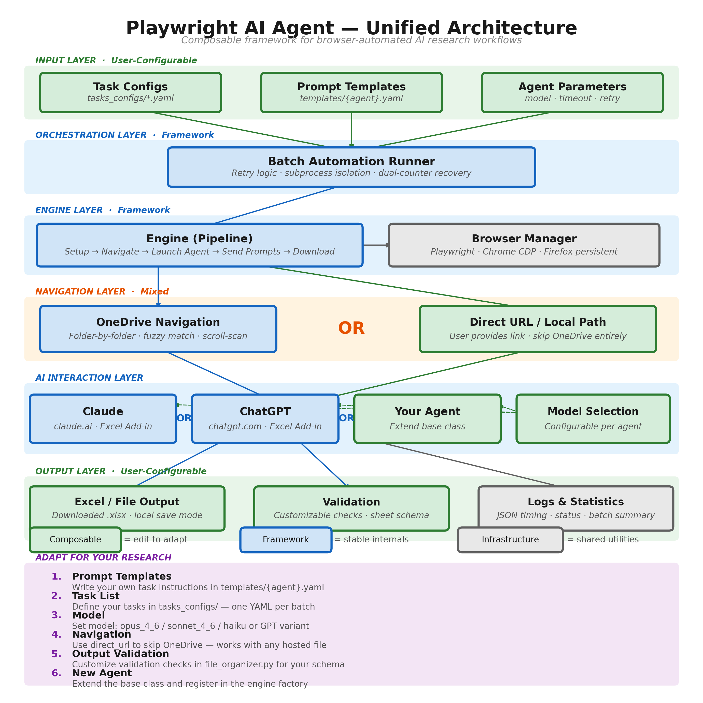

# Web Agent Automation

Batch execution of AI agents that work *inside the web chat UIs* of Claude.ai and ChatGPT. The runner connects to a real Chrome browser over the Chrome DevTools Protocol, opens a chat, uploads the task files, sends the prompt(s), and downloads the Excel workbook the model produces.

> **Looking at the MBABenchV2 repo as a whole?** The [repository README](../README.md) describes how the four pipelines and the judge fit together.

---

## How this compares to `excel-agents-master`

The sibling pipeline, [`excel-agents-master/`](../excel-agents-master/), runs AI add-ins *inside Excel Online* via OneDrive. Same kind of output, different runtime.

|  | This repo (`gui-agents-master`) | Sibling (`excel-agents-master`) |
|---|---|---|
| **Where the AI runs** | Web chat UI (claude.ai, chatgpt.com) | Excel Online add-in panel |
| **Required account** | Claude.ai login or ChatGPT Plus/Pro subscription | Microsoft 365 + OneDrive |
| **Browser** | Regular Chrome | Regular Chrome, signed in to Microsoft 365 |
| **Cloud orchestration** | EC2 dispatcher in `infra/` for multi-box runs | None — local machine only |

---

## One runner, two ways to feed it

`python -m infra.run --run-config <file>` is the entry point for every run. The run config decides where tasks come from and where results go:

| Run config | Audience | Tasks come from | Results go to |
|---|---|---|---|
| **Local** — a task-shaped YAML (`source.kind: yaml`, `sink.kind: local`) | Everyone | The YAML you write, pointing at your own workbook | Local disk (`scratch/`, `outputs/attempts.ndjson`) |
| **DB-backed** — an overlay with `source.kind: postgres_s3` | Teams with the benchmark Postgres + S3 | Postgres `tasks` table + S3 starting files | S3 + a `task_attempts` row (`sink.kind: postgres_s3`) |

The local path is documented first. The DB-backed path and the EC2 dispatcher follow.

---

## Prerequisites

- **Python 3.12+** and **[uv](https://docs.astral.sh/uv/)**
- **Regular Google Chrome** (stable channel — Canary's CDP breaks Playwright's download handling, see [Troubleshooting](#troubleshooting))
- **A web login** to your provider: a Claude.ai account, or a ChatGPT Plus/Pro subscription. No API keys are used.
- **Your own task workbook** (`.xlsx`) and, optionally, a case PDF. The repo ships no sample workbook (`*.xlsx` is gitignored).

---

## Install

`gui-agents-master` is a member of the MBABenchV2 uv workspace; dependencies install from the repo root:

```bash
git clone <repo-url>
cd MBABenchV2
uv sync
uv run python -m playwright install chromium
# Linux only: uv run python -m playwright install-deps chromium
```

Every command below runs from `gui-agents-master/`, prefixed with `uv run`.

---

## Quickstart — local run

### 1. Launch Chrome with CDP

The runner attaches to Chrome on CDP port **9222**. If nothing is listening there, it launches Chrome itself (`claude_web_agent/browser_manager.py`) with the profile from `<provider>_web.browser.profile_dir` — default `browser_profiles/chrome-claude` for Claude, `browser_profiles/chrome-chatgpt` for ChatGPT, resolved against the repo root and gitignored. **Auto-launch happens on 9222 only.** Any other `cdp_port` requires you to start Chrome yourself (see [Running Claude + ChatGPT in parallel](#running-claude--chatgpt-in-parallel)).

To launch it by hand (recommended the first time, so you can log in), run from `gui-agents-master/`; swap `chrome-claude` for `chrome-chatgpt` on ChatGPT runs:

**macOS:**
```bash
"/Applications/Google Chrome.app/Contents/MacOS/Google Chrome" \
  --remote-debugging-port=9222 \
  --user-data-dir="$PWD/browser_profiles/chrome-claude" \
  --no-first-run --no-default-browser-check \
  --disable-background-timer-throttling \
  --disable-backgrounding-occluded-windows \
  --disable-renderer-backgrounding \
  '--remote-allow-origins=*'
```

**Linux:**
```bash
google-chrome \
  --remote-debugging-port=9222 \
  --user-data-dir="$PWD/browser_profiles/chrome-claude" \
  --no-first-run --no-default-browser-check \
  --disable-background-timer-throttling \
  --disable-backgrounding-occluded-windows \
  --disable-renderer-backgrounding \
  --remote-allow-origins=*
```

**Windows (PowerShell):**
```powershell
& "C:\Program Files\Google\Chrome\Application\chrome.exe" `
  --remote-debugging-port=9222 `
  --user-data-dir="$PWD\browser_profiles\chrome-claude" `
  --no-first-run --no-default-browser-check `
  --disable-background-timer-throttling `
  --disable-backgrounding-occluded-windows `
  --disable-renderer-backgrounding `
  --remote-allow-origins=*
```

`--user-data-dir` is an isolated profile; the login persists there across runs until the cookies expire. It must match `profile_dir` in the run config.

### 2. Log into the provider

In that Chrome window, log in at https://claude.ai or https://chatgpt.com (Plus or Pro). Leave the browser open.

### 3. Optional: a project id

Set `<provider>_web.project_id` to start every task chat inside one project. `null` (the default) starts each chat outside any project.

- **Claude.ai:** `{project_id}` from `https://claude.ai/project/{project_id}`.
- **ChatGPT:** the hex id after `g-p-` in `https://chatgpt.com/g/g-p-{project_id}-{slug}/project`. `project_slug` is optional. A project id belongs to one account; a wrong one redirects to the homepage.

### 4. Write a run config

Copy [`infra/configs/run_configs/local_run_examples/sample_task.yaml`](infra/configs/run_configs/local_run_examples/sample_task.yaml) (Claude) or [`sample_task_chatgpt.yaml`](infra/configs/run_configs/local_run_examples/sample_task_chatgpt.yaml) and point `upload_files` at your workbook. A file whose top level has task fields (`task_name`, `upload_files`, `tasks`, …) *is* the task list; every other key is overlaid on the project-wide config for that run.

```yaml
task_name: "My_Analysis"
task_source: "my_tasks"
upload_files:
  - "/path/to/your/task/starting_file.xlsx"
  - "/path/to/your/task/case.pdf"          # optional
solution_name: "My_Analysis_Solution"      # optional

# ── project-wide overrides for this run ──
benchmark: v2
prompt_version: 205          # the default; see "Prompts and prompt_version"

provider:
  kind: "claude"             # or "chatgpt"

sink:
  kind: local
  output_dir: "outputs/my_tasks"

claude_web:
  model: "opus_4_8"
  effort: "max"
  project_id: null
```

Relative `upload_files` paths resolve against `local_files_base` if set, else the working directory; absolute paths are simplest. Use a top-level `tasks:` list to bundle several tasks in one file.

### 5. Run

```bash
# Preview — merges the config, resolves prompts and identity, opens no browser
uv run python -m infra.run --dry-run --run-config infra/configs/run_configs/local_run_examples/sample_task.yaml

# For real
uv run python -m infra.run -y --run-config infra/configs/run_configs/local_run_examples/sample_task.yaml

# Slice the task list
uv run python -m infra.run -y --start 0 --end 5 --run-config <file>
```

> **macOS laptops:** a sleeping Mac suspends Chrome mid-generation and burns a retry. Wrap long runs: `caffeinate -dimsu uv run python -m infra.run -y --run-config ...`

### 6. Where the output lands

Each attempt gets one working directory, named with the runner's pid so two runners on one machine never share it:

```
scratch/gui-agents/attempts/<ts>_<task>_p<pid>/
  solutions/                 # downloaded workbook(s)
  json_logs/                 # one completion_*.json per agent attempt
  logs/                      # runtime log + chat transcript
  prompts_<task>_<ts>.json   # the prompt text actually sent (+ attachments)
```

- **`sink.kind: local`** — the working directory is **kept** (the sink copies nothing), and one JSON line per attempt is appended to `<sink.output_dir>/attempts.ndjson` (default `outputs/attempts.ndjson`) with the paths to the workbook and logs.
- **`sink.kind: postgres_s3`** — the contents are uploaded to S3, mirrored under `paths.output_dir` (default `outputs/MBABenchV2/attempts/<agent>/<task>/<ts>_<run_id>/`), and the working directory is **deleted**.

---

## DB-backed run (Postgres + S3)

For a team that keeps tasks in the benchmark Postgres schema and starting files in S3. Credentials come from `<repo>/config/config.yaml` (`database.v1_url` / `database.v2_url`, `aws.*`), selected by the run config's `benchmark:`; see the `database:` / `aws:` blocks in [`infra/configs/configs.default.yaml`](infra/configs/configs.default.yaml) for the resolution order. The boto3 default credential chain is deliberately not consulted.

An overlay-shaped run config (no task fields) selects the source, the sink and the provider axes:

```yaml
benchmark: v2
source:
  kind: postgres_s3
  schema: mbabenchv2
  filters:
    task_ids: [1, 2]              # or task_sources: ["jp"]
    skip_deprecated: true
    skip_already_attempted: true  # skip tasks this identity already has a non-failed attempt for
sink:
  kind: postgres_s3               # or `local` to pull from the DB but write nothing back
  schema: mbabenchv2
provider:
  kind: "claude"
prompt_version: 205
claude_web:
  mode: "chat"
  model: "fable_5"
  effort: "max"
```

Examples: [`infra/configs/run_configs/v2_fable5_claude.yaml`](infra/configs/run_configs/v2_fable5_claude.yaml), [`v2_sol56_chatgpt.yaml`](infra/configs/run_configs/v2_sol56_chatgpt.yaml), the `mbabenchv2_run_examples/` folder (local-sink and DB-sink variants), the v1 examples under `bizbenchv1_run_examples/`, and the throwaway smoke tests under `test_configs/` (prompt_version 0). Replace the `project_id` placeholders with ids from your own account, or set them to `null`.

```bash
uv run python -m infra.run --dry-run --run-config infra/configs/run_configs/v2_fable5_claude.yaml
uv run python -m infra.run -y --task-id 2 --run-config infra/configs/run_configs/v2_fable5_claude.yaml   # one task
uv run python -m infra.run -y --run-config infra/configs/run_configs/v2_fable5_claude.yaml              # the filtered set
```

Every attempt (success or agent failure) becomes a `task_attempts` row named by the resolved [agent identity](#agent-identity) and the `prompt_version`.

### EC2 dispatcher

`infra/dispatcher/` spins up EC2 boxes that each run `infra.run` against the same Postgres + S3, with Chrome logged in over VNC. Operator guide: [`infra/README.md`](infra/README.md); CLI reference: [`infra/dispatcher/common_commands.md`](infra/dispatcher/common_commands.md); manual box setup: [`infra/worker/systemd/SETUP.md`](infra/worker/systemd/SETUP.md). Per-box provider/model templates live in [`infra/dispatcher/config_templates/`](infra/dispatcher/config_templates/).

```bash
python -m infra.dispatcher.dispatch spinup --alias claude-1 --config-template infra/dispatcher/config_templates/claude_fable5_chat.yaml
python -m infra.dispatcher.dispatch login claude-1        # VNC tunnel to the box's Chrome
python -m infra.dispatcher.dispatch assign --n 20          # pull 20 eligible tasks, distribute
python -m infra.dispatcher.dispatch status                 # who's doing what
```

Running it against your own infrastructure needs an AWS account with EC2 permissions, a Postgres database and an S3 bucket laid out to the MBABenchV2 conventions (`tasks` / `task_attempts` tables, `s3://<bucket>/<task_path>` with attempts under per-agent folders). No schema migration ships for that; the local run is the turnkey path.

---

## Configuration reference

Config merges in three layers, later winning, all project-wide:

1. [`infra/configs/configs.default.yaml`](infra/configs/configs.default.yaml) — every knob and its default. A key it doesn't declare is rejected.
2. `infra/configs/configs.yaml` — your long-lived local overrides (gitignored: project ids, ports).
3. `--run-config <file>` — what to run this time.

### Prompts and `prompt_version`

Prompt text is **not** written in the run config. `prompt_version` is resolved through [`tasks_configs/prompts/registry.yaml`](tasks_configs/prompts/registry.yaml) to an ordered list of files, one chat turn each:

| Version | What it sends |
|---|---|
| `0` | Smoke test — one turn, returns the workbook plus a `TEST SHEET`. Never grade its output. |
| `1` | Version 0 plus the House Standards attachment, to exercise the attachment path. Never grade. |
| `9` | The benchmark-v1 single-turn payload (17-check rubric). |
| `200` | v2 3-step set: analyze → build (132-check rubric) → QA + download. |
| `201` | 200 folded into one turn. |
| `202` | 200 + the Questions-sheet convention: answers go into the starting workbook's `Questions` sheet as live formulas. |
| `203` | 201 + the Questions-sheet convention. |
| `204` | Rubric-free House Standards set, 3 turns; **attaches** `House_Standards_v1.md`. |
| `205` | Rubric-free House Standards prompt, one turn; same attachment. **Default.** |

The same number is written to `task_attempts.prompt_version`. Registry entries are immutable — new text gets a new number. See [`tasks_configs/prompts/README.md`](tasks_configs/prompts/README.md).

**Attachments.** An entry may declare `attachments:` — files uploaded after the task's own starting files on every run of that version (204 and 205 attach `<monorepo>/house_standards/House_Standards_v1.md`). The runner resolves them at startup, refuses to run if one is missing, lists them in `--dry-run` output, and records each one's name, sha256 and text in the per-attempt `prompts_*.json`.

There is no per-run prompt override. The pre-registry keys `prompts_file` and `prompts` are deprecated; a config that sets one loads with a warning.

### `benchmark`

`benchmark: v1 | v2` selects the experiment: database, S3 prefix and identity namespace. Set it in every run config.

### Agent identity

`task_attempts.agent_model_name` and the S3 folder are derived from the provider axes that change output (mode, model, effort / intelligence / speed), not written by hand. The tables live in [`infra/configs/agent_identity.py`](infra/configs/agent_identity.py) and are append-only; an axis combination with no entry is refused before the browser opens. v2 keys on mode + model (+ effort); v1 additionally on every UI axis.

### Model selection

Both providers select the model through the provider's own UI picker, by visible label (the label maps are `MODEL_LABELS` in `claude_web_agent/claude_web_agent.py` / `chatgpt_web_agent.py`). `null` keeps the session's current choice; benchmark runs must pin it, and v2 preflight refuses `null` for Claude.

**Claude** (`claude_web`): `model` ∈ `fable_5_1`, `fable_5`, `opus_5_5`, `opus_5`, `opus_4_8`, `opus_4_7`, `opus_4_6`, `sonnet_5`, `sonnet_4_6`, `haiku_4_5`; `effort` ∈ `low | medium | high | xhigh | max`; `mode` ∈ `chat | cowork` (asserted every task; `cowork_approval: auto` for unattended runs).

**ChatGPT** (`chatgpt_web`): `mode` decides which knobs apply.

| `mode` | Keys | Values |
|---|---|---|
| `chat` | `model` + `intelligence` | `model`: `gpt_5_6_sol`, `gpt_5_5`, `gpt_5_4`, `gpt_5_3`, `o3`, `gpt_6` · `intelligence`: `instant`, `medium`, `high`, `xhigh`, `pro` |
| `work` | `model` + `effort` + `speed` | `model`: `gpt_6_astra`, `gpt_5_6_sol`, `gpt_5_6_terra`, `gpt_5_6_luna`, `gpt_5_5` · `effort`: `light`, `medium`, `high`, `xhigh`, `max`, `ultra` · `speed`: `standard`, `fast` |

Setting the other mode's key is a misconfiguration (preflight error in `work`, warning in `chat`). `model: instant | thinking | pro` are one-axis legacy values that route to `intelligence`; new runs name a model.

> If ChatGPT model selection fails, the chat falls through to the project's **default** model. Keep that default cheap.

### "Continue" auto-retry

If the model stops without producing a workbook, the engine sends a "Continue" turn, up to 5 times per provider.

---

## CLI options (`python -m infra.run`)

| Flag | Default | Description |
|---|---|---|
| `--run-config FILE` | none | A task-shaped YAML (local run) or an overlay merged as the 3rd config layer |
| `--dry-run` | off | Merge, resolve prompts and identity, print the engine configs; no browser |
| `-y`, `--yes` | off | Skip the "proceed?" confirmation |
| `--start N` / `--end N` | 0 / all | Slice the task list (`--end` exclusive) |
| `--task-id N` | none | One task by DB id (postgres_s3 source only), re-run even if attempted |
| `--skip-if-attempted` | off | Force `skip_already_attempted` |
| `--timeout SEC` | none | Per-task timeout override |
| `--auth-precheck` | off | Probe the provider session over CDP first; exit 4 if it's dead |

Exit codes: `0` all attempts succeeded · `1` at least one failed · `2` config/preflight error · `3` no tasks matched · `4` environment gate blocked the run.

---

## Running Claude + ChatGPT in parallel

Two Chrome instances, two profiles, two ports. The runner auto-launches Chrome on **9222 only**; start the second browser yourself and set its run config's `cdp_port` to match.

```bash
# Browser A — port 9222 (Claude; the runner could also launch this one)
"/Applications/Google Chrome.app/Contents/MacOS/Google Chrome" \
  --remote-debugging-port=9222 --user-data-dir="$PWD/browser_profiles/chrome-claude" \
  --no-first-run --no-default-browser-check '--remote-allow-origins=*' &

# Browser B — port 9333 (ChatGPT; must be started by hand)
"/Applications/Google Chrome.app/Contents/MacOS/Google Chrome" \
  --remote-debugging-port=9333 --user-data-dir="$PWD/browser_profiles/chrome-chatgpt" \
  --no-first-run --no-default-browser-check '--remote-allow-origins=*' &
```

In the ChatGPT run config:

```yaml
chatgpt_web:
  browser:
    cdp_port: 9333
    profile_dir: "browser_profiles/chrome-chatgpt"
```

Then run both:

```bash
uv run python -m infra.run -y --run-config <claude-run>.yaml &
uv run python -m infra.run -y --run-config <chatgpt-run>.yaml &
wait
```

---

## Tests

Offline — no DB, AWS or browser:

```bash
uv run python -m pytest tests/
```

`tests/test_checked_in_configs.py` loads every run config and dispatcher template and asserts it merges, resolves prompts and an identity, and clears preflight. Run it after touching `infra/configs/` or `infra/dispatcher/config_templates/`.

---

## Troubleshooting

**Browser session expired.** Relaunch Chrome with the same `--user-data-dir` and log in again.

**`Chrome not reachable on CDP port 9222` / `Chrome not running on port N`.** Check with `lsof -i :9222 -sTCP:LISTEN` and `ps aux | grep remote-debugging-port`. The Chrome you launched must use the port in `<provider>_web.browser.cdp_port` and the same `--user-data-dir` you logged in with; on a non-9222 port the runner never launches Chrome for you.

**`Protocol error (Browser.setDownloadBehavior): Browser context management is not supported`.** Chrome Canary incompatibility — use regular Chrome.

**`0 artifact preview cards found` (ChatGPT).** The model answered in text without producing a workbook. Work mode is the surface that most reliably produces files.

**`You don't have access to this project` (ChatGPT).** The `project_id` belongs to a different account than the one logged into that browser.

**Exit code 2 with `PromptVersionError` or `UnknownAgentCombination`.** The prompt version isn't registered, or the provider axes name no identity. `--dry-run` reproduces both in a second.

**Playwright not installed** (`Executable doesn't exist`): `uv run python -m playwright install chromium` (Linux: also `install-deps chromium`).

---

## Architecture



| Layer | Role | Key files |
|---|---|---|
| **Input** | Run configs, prompt registry, task source | `infra/configs/`, `tasks_configs/prompts/`, `task_io/sources/` |
| **Orchestration** | Config merge, preflight, per-task subprocess, retry | `infra/run.py` |
| **Engine** | Single-task pipeline (setup → navigate → AI → download) | `claude_web_agent/claude_web_engine.py` |
| **Navigation** | Chrome CDP connection | `claude_web_agent/browser_manager.py` |
| **AI interaction** | Claude, ChatGPT, or your own provider | `claude_web_agent/claude_web_agent.py`, `chatgpt_web_agent.py` |
| **Output** | Validation, JSON logs, sink | `claude_web_agent/file_validator.py`, `completion_logger.py`, `task_io/sinks/` |

See [`docs/ARCHITECTURE.md`](docs/ARCHITECTURE.md) for the seams and how to add a provider.

---

## Project structure

```
gui-agents-master/
├── infra/
│   ├── run.py                        # entry point — one engine subprocess per task
│   ├── configs/                      # configs.default.yaml + run_configs/
│   ├── dispatcher/                   # laptop-side EC2 dispatch CLI + box templates
│   └── worker/                       # box-side worker loop + systemd units
├── task_io/
│   ├── sources/                      # yaml_source.py, postgres_s3.py
│   └── sinks/                        # local_sink.py, postgres_s3.py
├── claude_web_agent/
│   ├── claude_web_agent.py           # Claude.ai provider
│   ├── chatgpt_web_agent.py          # ChatGPT provider
│   ├── claude_web_engine.py          # shared per-task engine
│   ├── browser_manager.py            # Chrome CDP connection
│   ├── completion_logger.py          # crash-safe JSON logging
│   ├── file_validator.py             # Excel file validation
│   └── web_agent.py                  # abstract base class
├── tasks_configs/prompts{,_pv9,_v2,_v3,_v4}/  # prompt text + registry.yaml
├── tools/                            # build_house_standards_prompts.py (generates the 204/205 text)
├── tests/                            # offline pytest checks
├── docs/                             # architecture diagram + ARCHITECTURE.md
└── pyproject.toml
```
