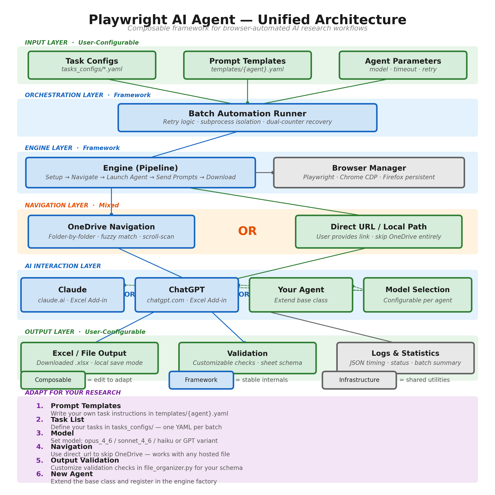

# Playwright AI Agent — Architecture Guide

> Composable framework for browser-automated AI research workflows.



---

## Example: Running a Task End-to-End

Suppose you want an AI agent to analyze a dataset and produce a summary spreadsheet.

### Step 1 — Write your prompts

The prompt template defines what instructions the AI receives, in order. You can write anything here — the framework just sends the strings sequentially and waits for each response.

```yaml
# tasks_configs/templates/claude.yaml
template:
  agent_type: "claude_web"     # See agent_type table below

  prompts:
    - "Analyze the attached dataset. Identify the top 10 trends by revenue."
    - "Create a sheet called 'Summary' with a pivot table of results."
    - "Add a chart on a new sheet called 'Visualization'."

  claude_web:
    model: opus_4_6            # See model options table below
```

You can have 1 prompt or 20. Compare this to the default prompts that ship with the repo — those are multi-paragraph financial-modeling instructions with rubric criteria. Your prompts can be completely different.

#### `agent_type` values

| Branch | Agent | `agent_type` |
|--------|-------|-------------|
| `gui-system-master` | Claude | `claude_web` |
| `gui-system-master` | ChatGPT | `chatgpt_web` |
| `excel-agents-master` | Claude | `claude_excel_agent` |
| `excel-agents-master` | ChatGPT | `chatgpt_excel_agent` |
| `excel-agents-master` | TabAI | `tabai` |

#### Model options

| Branch | Agent | Config key | Options |
|--------|-------|-----------|---------|
| GUI | Claude | `claude_web.model` | `opus_4_6`, `sonnet_4_6`, `haiku_4_5` |
| GUI | ChatGPT | `chatgpt_web.model` | `instant`, `thinking`, `pro` |
| Excel | Claude | `claude_excel_agent.model` | `opus_4_6`, `sonnet_4_6` |
| Excel | ChatGPT | `chatgpt_excel_agent.model` | `fast`, `standard`, `heavy` |

Set to `null` or omit to use whatever model is currently active in your session.

### Step 2 — Define your task list

All files are **local** — you list them and they get uploaded directly into the chat.

```yaml
tasks:
  - task_name: "Q1-Revenue-Analysis"

    # Local files to upload into the AI chat
    upload_files:
      - "tasks/Q1/q1_data.csv"
      - "tasks/Q1/problem_statement.pdf"

    # Custom output file name (optional)
    solution_name: "Q1_Revenue_Solution"

  - task_name: "Q2-Revenue-Analysis"
    upload_files:
      - "tasks/Q2/q2_data.csv"
```

**Excel add-in branch** — files live on OneDrive; the engine navigates there:
```yaml
tasks:
  - task_name: "Q1-Revenue-Analysis"
    onedrive_path: ["My files", "ProjectX", "Q1"]
    template_file: "Q1_Template.xlsx"
    upload_files:
      - "problem_statement.pdf"
```

### Step 3 — Run

```bash
# GUI branch
python claude_web_batch_runner.py \
  --tasks tasks_configs/examples/my_tasks.yaml \
  --template tasks_configs/templates/claude.yaml

# Excel add-in branch
python batch_automation_runner.py \
  --tasks tasks_configs/examples/my_tasks.yaml \
  --runner-config runner_configs/claude.yaml
```

The system will: connect to the browser → navigate to the provider → upload files or open the workbook → send each prompt sequentially → download the resulting `.xlsx` → validate → log → move to the next task (retrying on failure).

### Step 4 — Swap anything

Switch agent: change `agent_type`. Switch model: change `model`. Different instructions: rewrite the `prompts` list. The framework, retry logic, and output pipeline stay the same.

---

## Adding Your Own Agent

Both branches use a base class + factory pattern.

### GUI branch

1. **Subclass `WebAgent`** (`claude_web_agent/web_agent.py`) — implement 9 abstract methods:

   | Method | Purpose |
   |--------|---------|
   | `navigate_to_new_chat()` | Open a fresh conversation |
   | `get_state()` | Return current agent state (running, ready, error) |
   | `upload_files(file_paths)` | Upload local files into the chat |
   | `submit_prompt(prompt)` | Type and send a prompt |
   | `wait_for_response()` | Wait for the AI to finish responding |
   | `download_all_artifacts()` | Download files the AI produced |
   | `get_conversation_history()` | Return conversation messages |
   | `process_all_prompts(files)` | Orchestrate the full prompt sequence |
   | `ensure_features_enabled()` | Model selection, agent mode toggles |

2. **Register** in `create_agent()` in `claude_web_engine.py`:
   ```python
   elif provider_key == "my_agent":
       return MyAgent(page, config, shutdown_event, completion_logger)
   ```

3. **Create a template** with `agent_type: "my_agent"`.

### Excel add-in branch

1. **Subclass `AIAgentCore`** (`excel_agent/core/ai_agent_base.py`) — implement 3 abstract methods:

   | Method | Purpose |
   |--------|---------|
   | `get_agent_type()` | Return agent type string for logging |
   | `get_addon_name()` | Add-in name as shown in Excel (e.g., "Claude by Anthropic") |
   | `get_open_button_text()` | Button text to open the add-in panel |

   The base class handles ribbon navigation, prompt sending, response waiting, and model selection.

2. **Register** in `engine.py`:
   ```python
   elif agent_type == "my_addin":
       ai_agent = MyAddinCore(excel_page, config, shutdown_event, completion_logger)
   ```

3. **Create a template** with `agent_type: "my_addin"`.

---

## Output

Every run produces:

```
{YYYYMMDD}_{agentLabel}/
├── solutions/          # Downloaded .xlsx files
├── json_logs/          # Per-task completion JSONs
└── batch_summary.txt   # Human-readable run report
```

**JSON logs** include: `task_name`, `task_status` (`success` / `agent_failure` / `pipeline_failure`), `duration_seconds`, `attempt_number`, per-prompt timing, and model used.

**Validation** checks each downloaded file: exists, non-empty, openable by `openpyxl`, and contains expected sheets. Edit `validate_excel_file()` in `file_organizer.py` (or `file_validator.py` on the GUI branch) to change which sheets are required.

All output is local — no cloud uploads or database writes.

```python
# Example: read logs programmatically
import json
from pathlib import Path

for log in Path("20260327_claudeGUI/json_logs").glob("*.json"):
    data = json.loads(log.read_text())
    print(f"{data['task_name']}: {data['task_status']} in {data['duration_seconds']:.0f}s")
```

---

## What You Don't Need to Change

| File | Role |
|------|------|
| `batch_automation_runner.py` / `claude_web_batch_runner.py` | Retry orchestration |
| `engine.py` / `claude_web_engine.py` | Pipeline phases |
| `browser_manager.py` | Playwright lifecycle |
| `logging_setup.py`, `completion_logger.py` | Logging (automatic) |

> Full setup, prerequisites, and troubleshooting are in the [README](../README.md).
